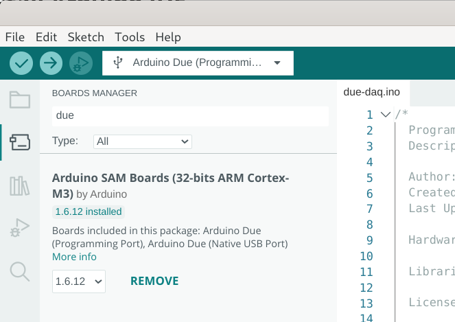

# Prepare Arduino Due

To use the Arduino Due as a data acquisition device, the first step is to flash the [duedaq](https://github.com/DaqOpen/daqopen-lib/blob/main/firmware/due-daq/due-daq.ino) firmware. This firmware enhances the Arduino Due with several key features for data acquisition, including:

- **Configuring the ADC in DMA mode**: Enables efficient, high-speed data handling by utilizing Direct Memory Access (DMA) for analog-to-digital conversion.
- **Setting ADC input mode**: Supports both single-ended and differential input modes, where single-ended measures voltage relative to ground and differential measures the difference between two signals.
- **Adjusting ADC input offset mode**: Option to remove any input offset before amplification in single-ended mode for reducing risk of input saturation.
- **Setting ADC input gain**: Allows amplification of the input signal for improved signal clarity and accuracy (1-4x).
- **Adjusting ADC prescaler**: Controls the sampling rate, with a maximum cumulative sample rate of 1000 kS/s.
- **Enabling specific channels for sampling and streaming**: Select and activate the channels you want to monitor and stream data from.
- **Configuring the DMA buffer size**: Adjust the buffer size to optimize data transfer performance according to your needs.
- **Transferring data via the native USB interface**: Allows high-speed communication between the Arduino Due and your (edge) computer for real-time data analysis.

The following table shows the channel mapping between Atmel SAM3X8E notation and Due Board Pin Names:

| Due Board Pin (SE) = DueDaq Channel | Due Board Pin (DIFF) = DueDaq Channel | SAMD Pin |
| ----------------------------------- | ------------------------------------- | -------- |
| A0                                  |                                       | AD7      |
| A1                                  | **A1** (A1-A0)                        | AD6      |
| A2                                  |                                       | AD5      |
| A3                                  | **A3** (A3-A2)                        | AD4      |
| A4                                  |                                       | AD3      |
| A5                                  | **A5** (A5-A4)                        | AD2      |
| A6                                  |                                       | AD1      |
| A7                                  | **A7** (A7-A6)                        | AD0      |
| A8                                  | **A8** (A8-A9)                        | AD10     |
| A9                                  |                                       | AD11     |
| A10                                 | **A10** (A10-A11)                     | AD12     |
| A11                                 |                                       | AD13     |

A very good pinout graph can be found here: https://www.robgray.com/temp/Due-pinout.pdf

## 0. Install Arduino IDE

If you don't have the Arduino IDE installed yet, please do so by following the instructions written here:

https://www.arduino.cc/en/software

In some cases, you must add your user to the dialup-group to flash the device successfully and further use the USB connection for gathering the measured data.

```bash
sudo usermod -a -G dialup username
```

After executing this command, you have once to logout and login to your PC.


## 1. Download and Install Board Library

By default, the Arduino IDE only comes with the AVR support. The Arduino DUE has an ARM controller (ATSAMD), and so you must install an additional library to compile and upload the code.



1. Open the Boards Manager on the left panel
2. Type "due" in the search field on the top
3. Press "INNSTALL"
4. Wait until installation is finished


## 2. Compile and Flash

Now, you are ready to compile and flash the due-daq firmware.

1. Download the due-daq.ino file here https://github.com/DaqOpen/daqopen-lib/blob/main/firmware/due-daq/due-daq.ino or clone the whole repository with `git clone https://github.com/DaqOpen/daqopen-lib.git`
2. Open the due-daq.ino in Arduino IDE
3. Connect the Arduino Due to your PC: Use the Programming Port (this is the micro-USB port near to the power socket)
4. Select the Programming Port on the top
5. Press the "Upload" button


## 3. Finished

Now you are ready to use the Arduino Due as DAQ-device together with the daqopen-lib!