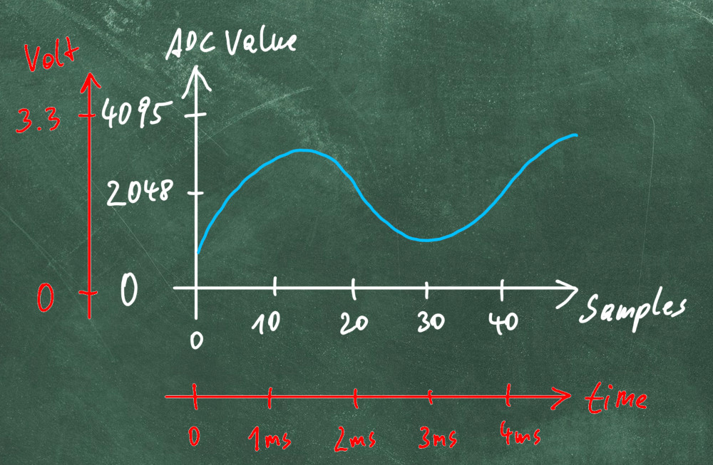

# Create DaqInfo

In this tutorial, we will re-use the setup from before to scale (aka calibrate) the input in the manner, that the output graph shows  physical values in x (value) and y (time) axis.

The following steps must therefore be performed:

- Apply a known signal to the input
- Calculate scaling and offset factors
- Adjust the time axis
- Create the DaqInfo object and perform a second measurement



**`DaqInfo`** consists of the following:

- **`BoardInfo`**

    - type: The type of daq-board

    - samplerate: Wanted samplerate to be set

    - (other parameter: see Reference)

- **`InputInfo`**

    - gain: The gain applied to the input channel.

    - offset: The offset applied to the input channel.

    - delay: The delay in sample periods for this channel.

    - unit: The unit of the measurement.

    - ai_pin: The analog pin on the Arduino Due board


## Value axis scaling (InputInfo)

In this step, we will do a scaling of the value axis (the physical measurement value)

1. **Connect the Function Generator:**

    Use the following wiring setup:

    

    Connect the "inner" part of the BNC connector (signal) to the A1 pin, and the GND to the GND pin. 

2. **Configure the Function Generator:**
	
    Set the function generator to output a signal with the following properties:

    - **Waveform:** DC
    - **Amplitude:** 0.5 V

3. **Enable the Output of the Function Generator.**

4. **Prepare a script to read the average value**

    ```python
    from daqopen.duedaq import DueDaq
    import numpy as np
    import matplotlib.pyplot as plt
    
    def read_one_daq_block(daq_device: DueDaq):
        daq_device.start_acquisition() # Start the acquisition device
        data = daq_device.read_data() # Read one block of data
        daq_device.stop_acquisition() # Stop the acquisition
        return data
    
    # Create an instance of DueDaq and search for the device
    myDaq = DueDaq()
    
    # First Setpoint
    input("First Setpoint: apply 0.5V and press enter")
    data = read_one_daq_block(myDaq)
    low_value = data.mean() # Calculate average to remove noise
    # Print average
    print(f"Value of A0: {low_value:.3f}")
    
    # Second Setpoint
    input("Second Setpoint: apply 3.0V and press enter")
    data = read_one_daq_block(myDaq)
    high_value = data.mean() # Calculate average to remove noise
    # Print average
    print(f"Value of A0: {high_value:.3f}")
    
    # Calculate Gain and Offset
    gain = (3.0 - 0.5) / (high_value - low_value)
    offset = offset = gain * high_value - 3.0
    print(f"Gain: {gain:.5E}   Offset: {offset:.5E}")
    
    # Scale data
    A0 = data*gain - offset
    
    # Plot
    plt.plot(data_ts, A0)
    plt.grid()
    plt.show()
    ```

    In this script, the following steps are performed:

    - **Acquire** the data for the **first** set-point (low-value) and calculate the average value
    - **Acquire** the data for the **second** set-point (high-value) and calculate the average value
    - **Calculate the gain** = (set_point_high - set_point_low) / (high_value - low_value)
    - **Calculate the offset** = gain * high_value - set_point_high
    - **Apply gain and offset** to the last reading and display the data

    You will see an example output like this:

    ```
    First Setpoint: apply 0.5V and press enter
    Value of A0: 616.640
    Second Setpoint: apply 3.0V and press enter
    Value of A0: 3761.301
    Gain: 7.94998E-04   Offset: -9.77193E-03
    ```
    
    
    
5. **Visualize the adjusted data**
    

    As you can see, the average value is now exactly at 3.0 V as expected!

## Time axis scaling

Now we will also do a scaling of the x-axis to view real timestamps and not sample numbers.

1. **Configure the Function Generator:**

    Set the function generator to output a signal with the following properties:

    - **Waveform:** Sine
    - **Frequency:** 100 Hz
    - **Amplitude:** 3 Vpp
    - **Offset:** 1.6 V
   
1. **Prepare script for reading some data packages and measuring the time**

    ```python
    from daqopen.duedaq import DueDaq
    import numpy as np
    import matplotlib.pyplot as plt
    import time

    # Create an instance of DueDaq and search for the device
    myDaq = DueDaq()

    # Start the acquisition device
    myDaq.start_acquisition()

    # Remember start timestamp for checking the samplerate
    start_ts = time.time()
    number_of_samples = 0

    # Read 10 block of data
    for i in range(10):
       data = myDaq.read_data()
       number_of_samples += data.shape[0]

    # Remember stop timestamp
    stop_ts = time.time()

    # Stop the acquisition
    myDaq.stop_acquisition()

    # Calculate Samplerate
    samplerate = number_of_samples/(stop_ts - start_ts)
    print(f"Calculated samplerate: {samplerate:.1f} samples/second")
    print(f"Set samplerate: {myDaq.samplerate:.1f} samples/second")

    # Plot corrected time axis
    data_ts = np.arange(data.shape[0]) / myDaq.samplerate # Time Axis value in seconds
    fig, ax = plt.subplots()
    ax.plot(data_ts, data)
    ax.set_xlabel("Time in seconds")
    plt.grid()
    plt.show()
    ```

    In this script, the following steps are performed:

    - Start the Acquisition and **remember the start timestamp**
    - **Perform an acquisition of 10 Blocks** and count the samples
    - **Remember the stop timestamp**
    - **Calculate the samplerate:** number of samples acquired divided by time which was needed to acquire the samples

    Example output:

    ```
    Calculated samplerate: 49991.4 samples/second
    Set samplerate: 50000.0 samples/second
    ```

    


## Create DaqInfo

Now, let's collect all the data in a toml file to load it the next time (including placeholder for the other channels of the board):

```toml
# This is a Arduino Due DAQ Configuration File
[board]
type = "duedaq"
samplerate = 50000 # Samplerate to be set

[channel.A0] # This is the channel we inspected now
gain= 7.94998E-04
offset = -9.77193E-03
delay = 0
unit = "V"
```

This file will be used in the following tutorials together with the Channelbuffer to demonstrate more advanced use cases.

