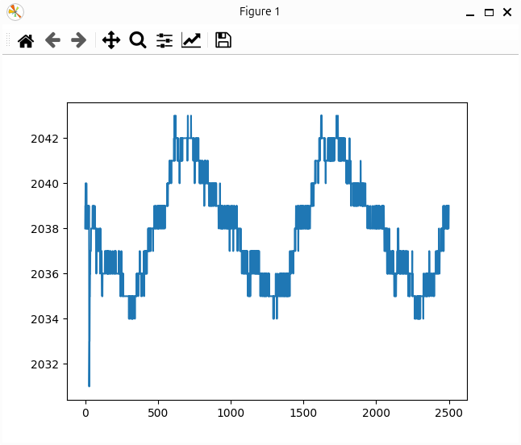

# Getting Started with Data Acquisition on Arduino Due

In this tutorial, you will learn step-by-step how to perform data acquisition using the Arduino Due. The process involves the following steps:

1. Taking an initial measurement without any external connections.
2. Connecting a signal generator.
3. Visualizing the acquired signal.
4. Interpreting the resulting waveform.

**Prerequisites:** Make sure you have completed the general setup steps:

- [Prepare Arduino Due](../how-to/prepare-arduino-due.md)
- [Setup Python Environment](../how-to/setup-python-environment.md)

## Your First Data Acquisition

1. **Connect the Arduino Due:** 
    
    Use the native USB port on the Arduino Due (located next to the reset button) to connect it to your PC.

2. **Set Up Your Development Environment:**

    Open your preferred IDE, activate the virtual environment (or open the project folder), and create a new Python file.

3. **Run Your First Acquisition:**

    Use the following code to perform your first data acquisition.

    ```python
    from daqopen.duedaq import DueDaq
    import numpy as np
    import matplotlib.pyplot as plt

    # Create an instance of DueDaq and search for the device
    myDaq = DueDaq()

    # Start the acquisition device
    myDaq.start_acquisition()

    # Read one block of data
    data = myDaq.read_data()

    # Stop the acquisition device
    myDaq.stop_acquisition()

    # Plot the data
    plt.plot(data)
    plt.show()
    ```

4. **Execute the Script:**
    
    Save and run the Python file (Click the Play button in the top-right corner if using VS Code).

5. **Inspect the Data:**

    You should see a plot like this:

    

    !!! note
        If no signals are connected to the ADC inputs (A0-A11), you might observe some quantization noise, which depends on the environment.

6. **Verify Console Output:**
    
    Your console should display messages similar to:

    ```
    Device found on Port: /dev/ttyACM0
    DueDaq Init Done
    DueDaq Wait for Frame Start
    DueDaq Search Start
    DueDaq ACQ Started
    ```

7. **Success!**
    
    You have successfully completed your first data acquisition.

## Connecting a Signal

Now that the basic setup is verified, you can proceed to acquire data from an actual signal. In this example, you'll connect a function generator to the Arduino Due.

1. **Connect the Function Generator:**

    Use the following wiring setup:

    

    Connect the "inner" part of the BNC connector (signal) to the A1 pin, and the GND to the A0 pin. To ensure a common ground, connect the Arduino's GND pin to the signal generator's GND through a 10kΩ resistor.

2. **Configure the Function Generator:**
    
    Set the function generator to output a signal with the following properties:
    
    - **Waveform:** Sine
    - **Frequency:** 1 kHz
    - **Amplitude:** 3 Vpp
    - **Offset:** 1.6 V
   
    !!! note
        The Arduino Due inputs cannot handle negative voltages, so an offset must be applied to the sine wave.
   
3. **Enable the Output of the Function Generator.**

4. **Re-run the Script:**

    Close the previous graph window and execute the script again.

5. **Inspect the Data:**

    You should see a plot like this:

    

    Signals will appear on every channel but with varying amplitudes. This is because the ADC samples each input using a multiplexer. If an input is not connected, the signal reflects the voltage on the internal capacitor of the ADC input stage. Either ignore these signals or tie the inputs to GND.

6. **Modify the Code to Plot a Specific Channel:**
    
    To focus on the channel where the signal is applied (AI1-AI0 corresponds to AD6, the 4th column in the array), modify the plotting section of the code as follows:

    ```python
    ...
    # Plot the data from the 4th column (index 3)
    plt.plot(data[:, 3])
    plt.show()
    ```

7. **Inspect the Data Again:**

    You should now see a clean sine wave:

    
    

    !!! note
        The sine wave will be between ADC values 0 and 30000. Internally, the signal is scaled from the 12-bit unsigned range (0-4095) to a 16-bit signed range (-32768 to 32767).

## Summary

In this tutorial, you successfully performed data acquisition using the Arduino Due. You learned how to:

- Acquire and visualize data without any external signal connections.
- Connect and acquire data from a function generator.
- Visualize specific channels to interpret the acquired waveform accurately.

By following these steps, you can now perform basic data acquisition tasks with the Arduino Due, laying the groundwork for more complex measurements and analyses.