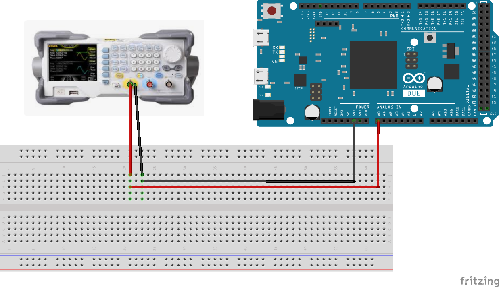

# Getting Started with Data Acquisition on Arduino Due

In this tutorial, you will learn step-by-step how to perform data acquisition using the Arduino Due. The process involves the following steps:

1. Taking an initial measurement without any external connections.
2. Connecting a signal generator.
3. Visualizing the acquired signal.
4. Interpreting the resulting waveform.

**Prerequisites:** Make sure you have completed the general setup steps:

- [Prepare Arduino Due](../how-to/prepare-arduino-due.md)
- [Setup Python Environment](../how-to/setup-python-environment.md)

## Your First Data Acquisition

1. **Connect the Arduino Due:** 
   
    Use the native USB port on the Arduino Due (located next to the reset button) to connect it to your PC.

2. **Set Up Your Development Environment:**

    Open your preferred Python IDE, activate the virtual environment (or open the project folder), and create a new Python file.

3. **Run Your First Acquisition:**

    Use the following code to perform your first data acquisition.

    ```python
    from daqopen.duedaq import DueDaq
    import numpy as np
    import matplotlib.pyplot as plt

    # Create an instance of DueDaq and search for the device
    myDaq = DueDaq()

    # Start the acquisition device
    myDaq.start_acquisition()

    # Read one block of data
    data = myDaq.read_data()

    # Stop the acquisition device
    myDaq.stop_acquisition()

    # Plot the data
    plt.plot(data)
    plt.show()
    ```

4. **Execute the Script:**
   
    Save and run the Python file (Click the Play button in the top-right corner if using VS Code).

5. **Inspect the Data:**

    You should see a plot like this:

    

    !!! note
        If no signals are connected to the ADC inputs (A0-A11), you might observe some quantization noise as well as ghost signals because of the high input impedance, which depends on the environment.

6. **Verify Console Output:**
   
    Your console should display messages similar to:

    ```
    2024-10-10 08:47:54,418 - daqopen.duedaq - INFO - Device found on Port: /dev/ttyACM0
    2024-10-10 08:47:54,426 - daqopen.duedaq - INFO - DueDaq Init Done
    2024-10-10 08:47:54,527 - daqopen.duedaq - INFO - DueDaq Wait for Frame Start
    2024-10-10 08:47:55,201 - daqopen.duedaq - INFO - DueDaq Search Start
    2024-10-10 08:47:55,251 - daqopen.duedaq - INFO - DueDaq ACQ Started
    2024-10-10 08:47:55,401 - daqopen.duedaq - INFO - DueDaq ACQ Stopped
    ```
   
7. **Success!**
   
    You have successfully completed your first data acquisition.

## Connecting a Signal

Now that the basic setup is verified, you can proceed to acquire data from an actual signal. In this example, you'll connect a function generator to the Arduino Due.

1. **Connect the Function Generator:**

    Use the following wiring setup:

    

    Connect the "inner" part of the BNC connector (signal) to the A0 pin, and the GND to GND pin.

2. **Configure the Function Generator:**
   
    Set the function generator to output a signal with the following properties:
    
    - **Waveform:** Sine
    - **Frequency:** 1 kHz
    - **Amplitude:** 3 Vpp
    - **Offset:** 1.6 V
    
	!!! note
		The Arduino Due inputs cannot handle negative voltages, so an offset must be applied to the sine wave.
   
3. **Enable the Output of the Function Generator.**

4. **Re-run the Script:**

    Close the previous graph window and execute the script again.

5. **Inspect the Data:**

    You should now see a clean sine wave:

    
    If you zoom in the front region, you see the single periods
    

    !!! note
        The sine wave will be between ADC values 0 and 4095. We will convert that to real voltage in the next tutorial.

## Summary

In this tutorial, you successfully performed data acquisition using the Arduino Due. You learned how to:

- Acquire and visualize data without any external signal connections.
- Connect and acquire data from a function generator.
- Visualize channel's data to interpret the acquired waveform accurately.

By following these steps, you can now perform basic data acquisition tasks with the Arduino Due, laying the groundwork for more complex measurements and analyses.