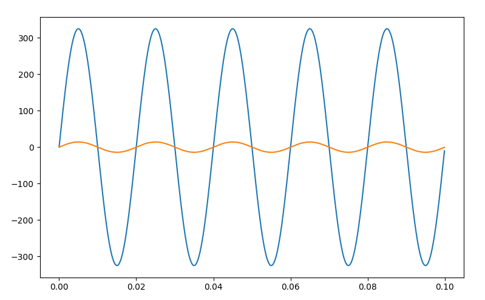

# Getting Started with pqopen-lib

In this tutorial, we’ll guide you step-by-step through the basics of using **pqopen-lib** and understanding its core concepts. By the end, you’ll be able to:

1. Create test signals
2. Configure a power system
3. Perform calculations
4. Output and analyze results

**Prerequisites:** Ensure you've completed the setup steps outlined here: [Setup Python Environment](../how-to/setup-python-environment.md)


## Installation

To get started, install **pqopen-lib** in your Python virtual environment. This library depends on **daqopen-lib**, which will be installed automatically if not already present.

```bash
source .venv/bin/activate
pip install pqopen-lib
```


## Step 1: Create Test Signals

We'll first create test signals to simulate input sources, replacing real-world waveforms. This approach allows us to control the input data and predict expected outcomes.

Since **pqopen-lib** operates on AC waveforms (as in a real power network), we’ll use a nominal voltage of 230V at 50 Hz (common in Europe). This tutorial covers a single-phase system; multi-phase setups are discussed separately.

Here's how to generate the test signals:

```python
import numpy as np
import matplotlib.pyplot as plt

samplerate = 10_000  # Hz
signal_duration = 1.0  # seconds

voltage_magnitude = 230.0  # Volt
current_magnitude = 10.0  # Ampere
frequency = 50.0  # Hz

# Create time vector
t = np.linspace(0, signal_duration, int(samplerate * signal_duration), endpoint=False)

# Generate voltage and current waveforms
u = voltage_magnitude * np.sqrt(2) * np.sin(2 * np.pi * t * frequency)
i = current_magnitude * np.sqrt(2) * np.sin(2 * np.pi * t * frequency)

# Plot the first 0.1 seconds of the waveforms
plt.plot(t[t < 0.1], u[t < 0.1], label="Voltage")
plt.plot(t[t < 0.1], i[t < 0.1], label="Current")
plt.legend()
plt.show()
```

When you run this script, the plotted waveforms will display the first 100 ms.



## Step 2: Configure the Power System

Next, we’ll configure a minimal power system. Start by adding these imports to your script:

```python
from pqopen.powersystem import PowerSystem, PowerPhase
from daqopen.channelbuffer import AcqBuffer
```

### Explanation of Imports:

- **PowerSystem**: A container class for configuring and operating the power system.
- **PowerPhase**: Represents a single power phase, which includes a voltage channel and optionally a current channel.
- **AcqBuffer**: A circular buffer for handling waveform data in blocks.

Now, configure the power system:

```python
# Create channels/buffers for waveform input
ch_t = AcqBuffer(dtype=np.int64)
ch_u = AcqBuffer()
ch_i = AcqBuffer()

# Initialize the power system
my_power_system = PowerSystem(zcd_channel=ch_u, input_samplerate=samplerate)

# Define a power phase and add it to the system
phase_1 = PowerPhase(u_channel=ch_u, i_channel=ch_i)
my_power_system.add_phase(phase_1)
```


## Step 3: Perform Calculations

Now, we’ll load the test data into the acquisition buffers and run the calculations.

```python
# Add test data to buffers
ch_t.put_data(t)
ch_u.put_data(u)
ch_i.put_data(i)

# Process the data
my_power_system.process()
```


## Step 4: Output the Results

Finally, inspect the calculation results. Since the calculations align with the fundamental frequency, each parameter produces a time series. We’ll print the latest values from all channels and display a time series for the channel `U1_rms`.

```python
# Print the latest values from all output channels
for ch_name, ch_buffer in my_power_system.output_channels.items():
    print(f"{ch_name:<14} {ch_buffer.last_sample_value:.2f} {ch_buffer.unit}")

print("-------")

# Extract and display time-series data for U1_rms
data, sidx = my_power_system.output_channels["U1_rms"].read_data_by_acq_sidx(0, int(samplerate * signal_duration))
print("sidx (ts): U1_rms")
for idx in range(data.size):
    ts = ch_t.read_data_by_index(sidx[idx], sidx[idx] + 1)[0]
    print(f"{sidx[idx]:d} ({ts:.2f}): {data[idx]:.2f} V")
```

### Output Example:

```
U1_hp_rms      230.00 V
U1_1p_rms      230.00 V
I1_1p_rms      10.00 A
P1_1p          2300.00 W
U1_1p_hp_rms   230.00 V
U1_rms         230.00 V
I1_rms         10.00 A
P1             2300.00 W
Q1_t           0.00 var
Freq           50.00 Hz
P_1p           2300.00 W
P              2300.00 W
-------
sidx (ts): U1_rms
2201 (0.22): 230.00 V
4201 (0.42): 230.00 V
6201 (0.62): 230.00 V
8201 (0.82): 230.00 V
```


## Notes on Results

- **Time Series Indexing**: The values in `DataChannelBuffer` are stored as `(sidx, value)` pairs. `sidx` is the sample index, starting from zero. To convert `sidx` into a real timestamp, use the `t` buffer.
- **Delayed Start**: The first value in `U1_rms` appears at 0.22 seconds. This delay occurs because the RMS calculation aggregates over 10 periods (200 ms at 50 Hz), starting from the first recognized zero crossing.


## Full Script

```python
import numpy as np
import matplotlib
matplotlib.use('qtagg')
import matplotlib.pyplot as plt

from pqopen.powersystem import PowerSystem
from daqopen.channelbuffer import AcqBuffer

samplerate = 10_000 # Hz
signal_duration = 1.0 # seconds

voltage_magnitude = 230.0 # Volt
current_magnitude = 10.0 # Ampere

frequency = 50.0 # Hz

# Create time signal
t = np.linspace(0,int(signal_duration),int(samplerate*signal_duration),endpoint=False)

# Create voltage signal
u = voltage_magnitude*np.sqrt(2)*np.sin(2*np.pi*t*frequency)

# Create current signal
i = current_magnitude*np.sqrt(2)*np.sin(2*np.pi*t*frequency)

# Plot signal (first 0.1s)
plt.plot(t[t<0.1], u[t<0.1])
plt.plot(t[t<0.1], i[t<0.1])
plt.show()

# Create Channel/Buffer for input waveform
ch_t = AcqBuffer()
ch_u = AcqBuffer()
ch_i = AcqBuffer()

# Create minimal power system
my_power_system = PowerSystem(zcd_channel=ch_u,
                              input_samplerate=samplerate)

# Create power phase and append to power system
my_power_system.add_phase(u_channel=ch_u, i_channel=ch_i)

# Add data to channels (we can apply all data at once because the 
# buffer is big enough to hold the test dataset)
ch_t.put_data(t)
ch_u.put_data(u)
ch_i.put_data(i)

# Perform calculation
my_power_system.process()

# View the results
for ch_name, ch_buffer in my_power_system.output_channels.items():
    print(f"{ch_name:<14} {ch_buffer.last_sample_value:.2f} {ch_buffer.unit}")

print("-------")

# Get time-series of one channel
data, sidx = my_power_system.output_channels["U1_rms"].read_data_by_acq_sidx(0, int(samplerate*signal_duration))
print("sidx (ts): U1_rms")
for idx in range(data.size):
    ts = ch_t.read_data_by_index(sidx[idx], sidx[idx]+1)[0] # read "real" timestamp
    print(f"{sidx[idx]:d} ({ts:.2f}): {data[idx]:.2f} V")
```


## Next Steps

Experiment with varying input parameters like frequency and sample rate to observe their effects on output accuracy. For instance:

- **Sample Rate**: 1,000 Hz
- **Frequency**: 49.7 Hz

**Example Output**:

```
U1_hp_rms      230.68 V
U1_1p_rms      230.69 V
I1_1p_rms      10.03 A
P1_1p          2313.76 W
U1_1p_hp_rms   230.69 V
U1_rms         229.55 V
I1_rms         9.98 A
P1             2290.96 W
Q1_t           0.00 var
Freq           50.00 Hz
P_1p           2313.76 W
P              2290.96 W
-------
sidx (ts): U1_rms
222 (0.22): 230.61 V
424 (0.42): 229.57 V
624 (0.62): 230.67 V
826 (0.83): 229.55 V
```

Notice how results deviate due to lower sampling precision (20.12 samples per cycle). In practical applications, ensure the sampling rate is at least 100 times the fundamental frequency for reliable results.