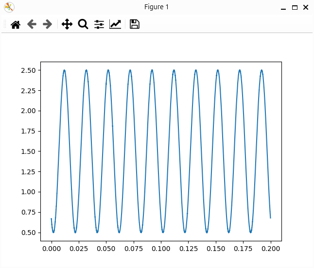
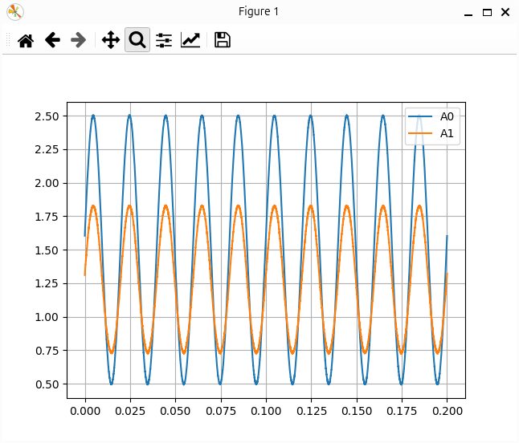

# Using `DaqInfo` with `ChannelBuffer`

In this tutorial, we'll demonstrate how to use the `DaqInfo` object (created in a previous tutorial) alongside the `ChannelBuffer` module. This will allow us to scale and store acquired data for easy access and further processing.

## Overview
The key steps to follow in this tutorial are:

- Load the `daqinfo.toml` file and create a `DaqInfo` object.
- Create an `AcqBufferPool` object, which will hold an `AcqBuffer` for each channel.
- Fill the buffer with data from the acquisition process.
- Read back and display the stored data.
- Extra: how to perform [cyclical calculation](#cyclical-calculation)

**Prerequisites:** Ensure you’ve completed the previous tutorial and saved your `DaqInfo` configuration as `daqinfo.toml`.

## Getting started
This example demonstrates how to acquire data, store it in a buffer, and retrieve it for visualization.

1. **Connect the Function Generator:**

    Set up the wiring as shown in the diagram:

    

    Connect the "inner" part of the BNC connector (signal) to the A1 pin, and the GND to the GND pin.

2. **Configure the Function Generator:**

    Adjust the function generator to output a sine wave signal with the following settings:

    - **Waveform:** Sine
    - **Frequency:** 50 Hz
    - **Amplitude:** 2 Vpp
    - **Offset:** 1.5 V

    !!! note
        The Arduino Due inputs cannot handle negative voltages, so an offset must be applied to the sine wave.

3. **Enable the Function Generator Output**

    Make sure the function generator is actively outputting the signal.

4. **Prepare the script for reading the data**

    ```python
    from daqopen.channelbuffer import AcqBufferPool
    from daqopen.daqinfo import DaqInfo
    from daqopen.duedaq import DueDaq
    import matplotlib.pyplot as plt
    import tomllib
    
    # Load DaqInfo from daqinfo.toml
    with open("daqinfo.toml", "rb") as f:
        daq_info_dict = tomllib.load(f)
    
    # Create DaqInfo Object from dict
    my_daq_info = DaqInfo.from_dict(daq_info_dict)
    
    # Create an instance of with properties from the DaqInfo
    myDaq = DueDaq(channels=my_daq_info.ai_pin_name.values(), # Initialize all enabled channels from DaqInfo
                   samplerate=my_daq_info.board.samplerate) # Set the wanted samplerate
    
    # Create the Buffer with daqinfo
    acq_buffer = AcqBufferPool(daq_info=my_daq_info,
                               data_columns=myDaq.data_columns) # Provide info about the Channel-Column map
    
    # Start the Acquisition
    myDaq.start_acquisition()
    
    # Read some data packages and insert the data in the buffer
    for i in range(20):
        data = myDaq.read_data()
        acq_buffer.put_data_with_samplerate(data, myDaq.samplerate) # put data to buffer
    
    # Stop acquisition
    myDaq.stop_acquisition()
    
    # Read back 0.2s of data and plot
    ts = acq_buffer.time.read_data_by_index(0, int(myDaq.samplerate*0.2))
    for channel_name, channel_buffer in acq_buffer.channel.items():
        scaled_data = channel_buffer.read_data_by_index(0, int(myDaq.samplerate*0.2))
        plt.plot(ts/1e6, scaled_data, label=channel_name)
    
    # Plot data
    plt.legend()
    plt.grid()
    plt.show()
    ```

    Explanation of the Script:

    - **Loading `daqinfo.toml`:** The configuration file `daqinfo.toml` is loaded using `tomllib.load(f)`.
    - **Creating `DaqInfo`:** The `DaqInfo` object is instantiated using the dictionary from the TOML file with `DaqInfo.from_dict()`.
    - **Creating `DueDaq`:** The `DueDaq` object is instantiated with values from the `DaqInfo` this time. Here we set the `channels` to be read and the wanted `samplerate` per channel.
    - **Setting Up the Buffer:** The `AcqBufferPool` is initialized with the `DaqInfo` object as well as a dictionary defining the channels to `data_columns` index map. This buffer will hold the acquired data, with the correct scaling and buffer width based on the configuration.
    - **Starting Data Acquisition:** The `DueDaq.start_acquisition()` method manages the hardware and begins the acquisition process.
    - **Inserting Data into the Buffer:** Data is read in packets from the hardware and stored in the buffer. The `put_data_with_samplerate` method ensures that timestamps are aligned with the acquisition rate.
    - **Reading Back Data:** After acquisition, the first 200ms of data is retrieved from each activated channel using the buffer’s channel items.
    - **Visualizing the Data:** The retrieved data is plotted, showing the sine wave signal over a 200ms period.

5. **Run the script**

    Once the script is executed, you should see a sine wave displayed, representing the signal from 0 to 0.2 seconds:

    

    Notice that there are exactly 10 cycles of the 50 Hz signal within the 0.2s window, confirming the correct sampling rate.

6. **Enable a second channel**

    Until now, we only worked with the channel A0. Let's also use a second channel. To do so, we simply add a second channel section in the daqinfo.toml by copying the first one and replacing A0 with A1:

    ```toml
    # This is a Arduino Due DAQ Configuration File
    [board]
    type = "duedaq"
    samplerate = 50000 # Samplerate to be set
    
    [channel.A0] # This is the first channel
    gain= 7.94998E-04
    offset = -9.77193E-03
    delay = 0
    unit = "V"
    
    [channel.A1] # This is the second channel
    gain= 7.94998E-04
    offset = -9.77193E-03
    delay = 0
    unit = "V"
    ```

7. **Run the script again**

    

    Because there is no signal applied to the channel A1, you see a "ghost" signal due to capacitance of the input stage.

This tutorial provides a clear example of how to acquire, store, and visualize signal data using the `DaqInfo` and `ChannelBuffer` modules. Make sure to adapt the code and settings as needed for your specific use case.

## Cyclical calculation
In this section, we will use the same setup as before to perform a cyclical calculation every 0.2 seconds. The challenge here is to acquire the signal in an infinite loop, wait for the next 200 ms of data to be gathered, and then perform the necessary calculation. One advantage of this approach is that it’s easy to change the interval, as we can directly read the required data from the buffer without needing to track individual data packets.

1. **Script Adaption**

    ```python
    from daqopen.channelbuffer import AcqBufferPool
    from daqopen.daqinfo import DaqInfo
    from daqopen.duedaq import DueDaq
    from daqopen.helper import GracefulKiller
    import matplotlib.pyplot as plt
    import tomllib
    
    # Load DaqInfo from daqinfo.toml
    with open("daqinfo.toml", "rb") as f:
        daq_info_dict = tomllib.load(f)
    
    # Create DaqInfo Object from dict
    my_daq_info = DaqInfo.from_dict(daq_info_dict)
    
    # Create an instance of with properties from the DaqInfo
    myDaq = DueDaq(channels=my_daq_info.ai_pin_name.values(), # Initialize all enabled channels from DaqInfo
                   samplerate=my_daq_info.board.samplerate) # Set the wanted samplerate
    
    # Create the Buffer with daqinfo
    acq_buffer = AcqBufferPool(daq_info=my_daq_info,
                               data_columns=myDaq.data_columns) # Provide info about the Channel-Column map
    
    # Start the Acquisition
    myDaq.start_acquisition()
    
    # Create an exit handler to gracefully terminate the script
    app_killer = GracefulKiller()
    
    # Define the calculation interval
    calc_interval_samples = int(0.2 * myDaq.samplerate)  # number of samples for each 200ms interval
    previous_calc_sidx = 0  # stores the previous calculation's sample index
    
    # Infinite loop for data acquisition and calculations
    while not app_killer.kill_now:
       # Read one block of data from the DAQ device
       data = myDaq.read_data()
    
       # Insert the data into the acquisition buffer
       acq_buffer.put_data_with_samplerate(data, myDaq.samplerate)
    
       # Check if enough samples are available for the next calculation
       while (acq_buffer.time.sample_count - calc_interval_samples) > previous_calc_sidx:
           # Read a chunk of data corresponding to the interval size
            for channel_name, channel_buffer in acq_buffer.channel.items():
                data = channel_buffer.read_data_by_index(previous_calc_sidx, previous_calc_sidx + calc_interval_samples)
                print(channel_name, data.mean(), my_daq_info.channel[channel_name].unit)  # Perform the calculation
            previous_calc_sidx += calc_interval_samples # Update the index for the next cycle
    
    # Stop acquisition when the loop ends
    myDaq.stop_acquisition()
    ```

    Explanation of the Script:

    - **Graceful Exit Handling**:
     The `GracefulKiller` class enables the script to exit cleanly. It allows you to stop the infinite loop and shut down data acquisition in an orderly manner (e.g., when pressing `Ctrl+C`).

    - **Defining the Calculation Interval**:
     We define the calculation interval by converting 0.2 seconds into a number of samples using `calc_interval_samples`. The `previous_calc_sidx` variable helps track where the last calculation ended so that the next calculation starts from the right place.

    - **Main Acquisition and Calculation Loop**:
     The script runs an infinite loop where:
         1. Data is read from the DAQ device.
         2. The read samples are inserted into the acquisition buffer.
         3. The buffer is checked to see if enough data is available for the next calculation. If so, data is retrieved in chunks of `calc_interval_samples`.
         4. The mean value of each channel is calculated and printed.
         5. The index is updated so that the next calculation uses the correct data.

    !!! note "Timing Considerations"
        Since the calculation interval is determined by an integer number of samples, the interval may not be perfectly accurate. We will address this in a future tutorial, explaining how to manage such discrepancies.

    !!! note "CPU Time Usage"
        Be mindful of operations that consume a lot of CPU time. The DAQ device readout must be completed within the buffer size’s time limit to avoid acquisition errors. A potential solution is to decouple the acquisition process from other tasks using separate processes or queues (e.g., ZMQ).

2. **Run the script**

    To run the script, simply execute it from your Python environment. Ensure the DAQ device is connected and properly configured before starting the acquisition.

3. **View Output**

    ```
    A0 1.4987409 V
    A1 1.2717355 V
    A0 1.4987625 V
    A1 1.2717919 V
    A0 1.4986992 V
    A1 1.271727 V
    A0 1.4987506 V
    A1 1.2717544 V
    ...
    ```

